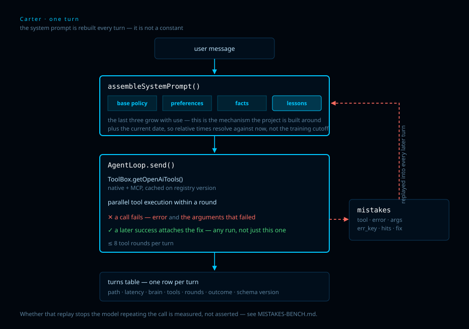

# Carter — an agent runtime that learns from its own failures

**C**ontext-**A**ssembling **R**untime for **T**ool **E**xecution and **R**ecall.

> **Alpha.** Running and measured, not stable. Interfaces, the cache key and the tool
> set will change. Every limit worth knowing is in [Honest limits](#honest-limits)
> rather than left for you to find.

An LLM agent runtime in TypeScript that is **its own MCP client**, loads skills from
markdown, and **records every failed tool call and replays it into every later turn**.
Whether that stops the model repeating the mistake is measured, not asserted — see
[MISTAKES-BENCH.md](MISTAKES-BENCH.md), which reports a case where it does not.
Each turn is logged — path, latency, tool, outcome — so the improvement is
something you can read out of a table rather than something the README asserts.

Every number below was measured on a real run. The command that produces each one is
given next to it. Nothing here is estimated.

## What is actually interesting here

**1. The system prompt is rebuilt every single turn.** It is not a constant. Four
sources compose it: base policy, learned preferences, tracked conversation facts, and
lessons from past failures. The last three grow with use — that is the mechanism the
whole project is built around.

```
$ npx tsx scripts/demo_prompt_enrichment.ts

  user typed   →    27 chars   "what's the weather in Oslo?"
  cold prompt  →  4347 chars   base policy
  warm prompt  →  4717 chars   after one recorded failure  (+370)
```

That +370 is a lesson injected verbatim into every later turn:

```
## Learned lessons — NEVER repeat these mistakes
- [#1] get_weather: "location must be a city name, not coordinates"
       → DO THIS INSTEAD: Pass the city name directly: { location: 'Oslo' }
```

**2. Capability gaps close themselves.** Hit a missing capability →
`search_extensions` (npm registry) → `install_mcp_server` (operator-approved) → the new
tools are live **the same turn**, and persist to `mcp_servers.json` for the next boot.
Declined installs are remembered and never proposed again.

**3. Mistake memory is a table, not a prompt trick.** Failed calls land in a `mistakes`
table on a shared SQLite connection, together with the arguments that failed; a later
success — in any run, not just the failing one — is attached as the recorded fix; user
corrections arrive via `record_lesson` and supersede older lessons.

It is also the part of this repo with a negative result attached, which is the honest
reason to read it. `npm test` includes an adversarial suite
(`scripts/stress_mistakes.ts`) that attacks the storage claim word by word, and
`npm run stress` is a paid A/B that attacks the *behavioural* claim. The A/B found that
replaying a failure **with no fix attached** made the model converge on the failing call
rather than avoid it — 1/5 → 5/5 exact repeats. Numbers, method and limits are in
[MISTAKES-BENCH.md](MISTAKES-BENCH.md). Lessons that carry a concrete fix are a
different path and were not measured this way.

**4. Tool calls within a round run in parallel**, and MCP tool schemas are cached
against a registry version rather than re-listed from every server on every turn.

## Measured

| | | How |
|---|---|---|
| Tool-call accuracy | **48/48** (16 prompts × 3 samples) | `npm run bench` |
| Latency, p50 / p95 | **894 ms / 1427 ms** | same run |
| Prompt tokens per call | **1800** (mostly the 23 tool schemas) | same run |
| Checks passing | **8 / 8** | `npm test` |

`npm run bench` sends fixed prompts through the model with the runtime's **real** tool
schemas and scores tool name plus required arguments. It never executes a tool —
`email_send` is in the live set. Full per-case results, including what is *not*
covered, are in [`BENCH.md`](BENCH.md); check results are in [`TESTS.md`](TESTS.md).

Both files are regenerated by their runner and are not hand-edited.

## Run it

```
npm install
cp .env.example .env        # set one key: OPENROUTER_API
npm run dev                 # terminal REPL
npm run web                 # HUD at http://127.0.0.1:3132
```

One key is enough. `config.ts` takes the first of `OPENROUTER_API` / `OPENAI_API_KEY`,
and `LLM_BASE_URL` + `LLM_MODEL` point the same OpenAI-compatible client at Ollama,
vLLM or LM Studio — switching provider is an env edit, never a code change.

Optional integrations (mailbox, library catalogue, Telegram, Calendar) stay dormant
until configured; unconfigured, their tools refuse before touching the network, which
is itself a tested path.

## Architecture



| Path | What lives there |
|---|---|
| `src/agent/` | loop, per-turn prompt assembly, context tracking |
| `src/memory/` | mistakes, per-turn log, consolidation, vault |
| `src/mcp/` | MCP registry — client *and* server |
| `src/tools/` | 19 native tools + MCP passthrough |
| `src/retrieval/` | provider waterfall (search/transcription fallback) |
| `scripts/` | checks, benchmark, demos — every number in this README |

## Honest limits

- **The success cache only fires on an exact repeat.** A request whose text matches one
  already answered replays its stored tool calls and is summarised locally, with no model
  call — measured once at 1016 ms with the LLM endpoint pointed at a dead port. That run
  shows the model-free path executes; it is n=1 and shows nothing about answer quality or
  general speed. Plans carrying a date, or any tool that is not read-only, are never
  cached at all.
- **The offline answer is excerpts, not a summary.** It ranks and quotes real sentences;
  it cannot compress one, reconcile two sources, or keep a correction attached to the
  claim it corrects. Replies from that path say so on the first line.
- **Tier 0 is not built.** Paths are `cache` and `tier1`; the small local router that
  would rewrite arguments for a near-miss needs a model download this repo avoids.
- **`src/retrieval/rerank.ts` is a no-op** that truncates in retrieval order. It is a
  placeholder, not a reranker, and nothing consumes it yet.
- **7 of the 23 exposed tools are untested by the benchmark** — destructive ones
  (`email_send`) are excluded on purpose, and the rest only make sense mid-conversation,
  which a single-turn harness cannot reach.
- **Three files carry pre-existing type errors** (`council.ts`, `telegram.ts`,
  `osVision.ts`). `tsx` runs fine; `npm run build` does not. They are listed in full in
  `TESTS.md` so a new error cannot hide among them.
- Web UI is loopback-only by design and has no auth.
